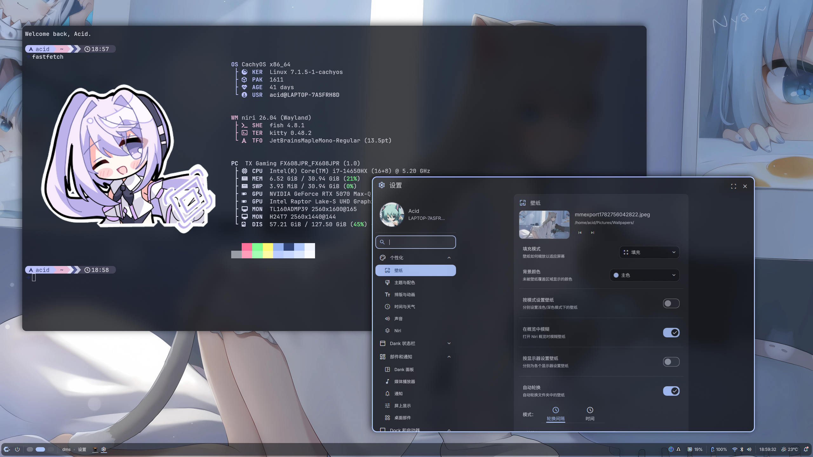
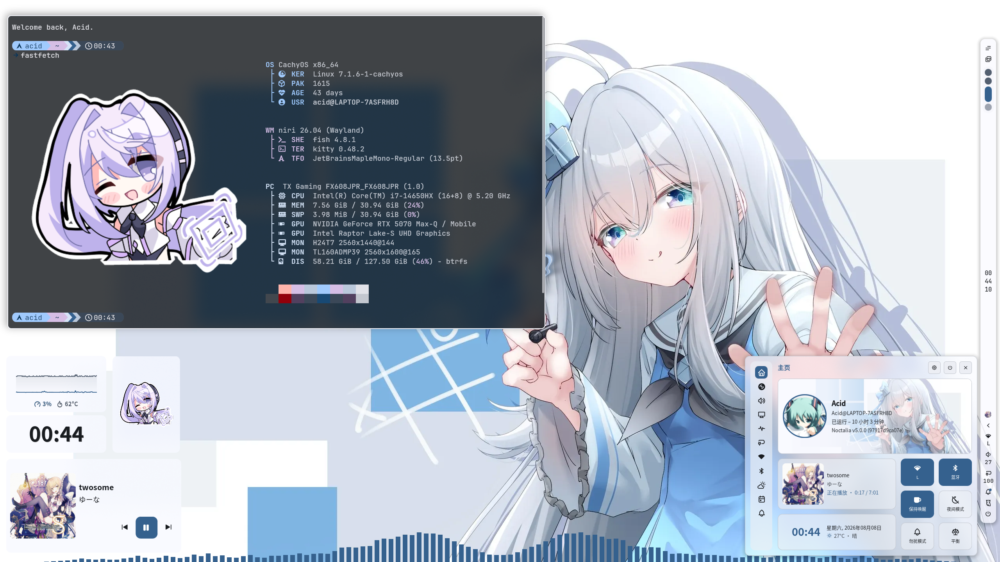

# Niri Wayland 双会话 Dotfiles 配置文档[此README将在不久后重写]

## 📖 dotfiles简介

本项目为 **Niri Wayland 桌面环境** 定制双会话配置方案，包含 `noctalia` 会话与 `dms` 会话。整套配置实现了自动化安装、壁纸随机切换、Matugen 动态主题配色、会话环境隔离(依旧施工中)等功能，全程轻量化、可复用、可一键部署，适配 Linux Wayland 桌面生态。

所有配置通过软链接统一管理，安装脚本安全可靠，采用**单文件删除\-即时链接**机制，避免全局配置丢失风险。

**新增Umbriel合成器配置**

## ✨ 核心功能特性

- **双会话隔离**：独立 Noctalia 美化会话 / DMS 轻量化会话，环境完全隔离，互不冲突

- **动态主题配色**：基于 Matugen 自动提取壁纸色调，生成系统全套主题配色

- **壁纸钩子联动**：Noctalia 会话支持壁纸更换钩子，自动重载配色方案

- **随机动漫壁纸**：两套独立壁纸脚本，分别适配双会话，通过快捷键调用 IPC 命令更换壁纸

- **安全一键安装**：分步式安装逻辑，删一项、链接一项，保障配置稳定性

- **标准化部署**：自动部署会话启动脚本、Wayland 会话入口文件、用户配置

## 🖼️ 效果预览





## 🔧 整体架构流程

**以下内容将在将来更新！！！**

### 1\. 桌面启动链路

greeted 显示管理器 → Wayland 会话文件 → 系统可执行会话脚本，完整启动链路如下：

```Plain Text
greeted
├─ niri-noctalia.desktop  # Noctalia会话入口
│  └─ /usr/local/bin/niri-noctalia-session  # Noctalia会话启动脚本
└─ niri-dms.desktop       # DankMaterialShell会话入口
   └─ /usr/local/bin/niri-dms-session       # DankMaterialShell会话启动脚本
```

### 2\. 主题配色生成机制

#### DMS 会话

完全交由 Matugen 全自动管理，无需自定义配置，自动读取当前壁纸、生成并应用全套系统配色，开箱即用。

#### Noctalia 会话

采用钩子联动机制，支持个性化配置，后续可迭代为 Noctalia 插件：

1. 监听壁纸更换 Hook 事件

2. 执行专属配色脚本：`.config/noctalia/scripts/matugen/matugen.sh`

3. 通过同目录 `config.json` 自定义 Matugen 配色规则

4. 自动生成并应用适配当前壁纸的系统主题

### 3\. 随机壁纸机制

双会话独立壁纸脚本，环境隔离，避免配置覆盖冲突：

- Noctalia 随机壁纸脚本：`.local/bin/random-anime-wallpaper-noctalia`

- DMS 随机壁纸脚本：`.local/bin/random-anime-wallpaper-dms`

**执行逻辑**：脚本获取随机动漫壁纸资源 → 调用 对应Shell IPC 命令更换壁纸 → 触发配色钩子重载主题。

核心 IPC 壁纸更换命令：`noctalia msg wallpaper-set` `dms ipc call wallpaper set`

## 📁 主要目录结构

```Plain Text
dotfiles/
├── init_install.sh                 # 项目一键安装入口脚本
├── bin/                            # 系统可执行脚本 & 安装脚本
│   ├── install.sh
│   ├── niri-dms-session            # DMS 会话启动器
│   └── niri-noctalia-session       # Noctalia 会话启动器
├── local_bin/                      # 下载并切换随机壁纸
│   ├── random-anime-wallpaper-dms
│   └── random-anime-wallpaper-noctalia
├── DankMaterialShell/              # DMS配置
│   └── settings.json
├── fastfetch/                      # 系统信息展示配置
│   ├── config.jsonc
│   ├── logo                        # 自定义Logo软链接目录，软链接至~/Pictures/fastfetch_logo/logo.png
│   └── tips
├── fish/                           # Fish 完整配置
│   ├── completions/
│   ├── conf.d/
│   ├── config.fish
│   ├── fish_variables
│   └── functions/                  # 自定义 fish 函数
├── kitty/
│   └── kitty.conf                  # Kitty 终端配色与配置
├── matugen/                        # Matugen 动态主题生成核心配置
│   ├── config.toml
│   └── templates/                  # 配色模板（终端/状态栏/图标/工具）
├── niri/                           # Niri 窗口管理器双会话完整配置
│   ├── config.kdl
│   ├── cfg/                        # 通用基础配置
│   ├── dms/                        # DMS 会话配置
│   ├── noctalia/                   # Noctalia 会话配置
│   ├── scripts/                    # Niri 自定义工具脚本
│   ├── dms.kdl
│   ├── niri-dms.kdl
│   ├── niri-noctalia.kdl
│   └── noctalia.kdl
├── noctalia/                       # Noctalia 配置
│   ├── noctalia-config.toml
│   ├── colors.json
│   ├── plugins.json
│   ├── user-templates.toml
│   └── scripts/matugen/            # 动态配色脚本
├── nvim/                           # Neovim 完整 Lazy 配置
│   ├── init.lua
│   ├── lazy-lock.json
│   ├── lua/config/
│   └── lua/plugins/
├── superfile/                      # Superfile 文件管理器配置
│   ├── config.toml
│   ├── hotkeys.toml
│   └── theme/                      # 预设主题
├── Preview/                        # 桌面效果图展示
│   ├── niri-dms.png
│   └── niri-noctalia.png
├── wayland-sessions/               # Wayland 会话入口文件
│   ├── niri-dms.desktop
│   └── niri-noctalia.desktop
├── xdg-desktop-portal/             # XDG 桌面门户适配配置
│   └── niri-portals.conf
├── mimeapps.list                   # 默认应用关联配置
├── user-dirs.dirs                  # 用户目录路径配置
├── user-dirs.locale
└── xdg-terminals.list              # 终端程序优先级配置
```

## ⚙️ 安装流程说明

### 安装核心规则

**禁止批量删除所有配置**：采用 **单配置删除\+即时软链接** 机制，处理完一项配置再处理下一项，最大程度避免配置丢失、系统异常。

### 分步安装逻辑

1. **用户配置软链接**：遍历 `dotfiles` 目录，逐个删除用户旧配置，即时创建新软链接到 `~/.config/`, 未来增加备份功能

2. **会话脚本部署**：将双会话启动脚本软链接至 `/usr/local/bin/`，覆盖旧版本文件

3. **Wayland 会话部署**：将桌面会话文件复制到 `/usr/share/wayland-sessions/`，供显示管理器识别加载

### 一键安装命令(施工中，未完成！！)

```Plain Text
chmod +x init_install.sh
./init_install.sh
```

## 🔄 未来迭代计划

- 将 Matugen 配色钩子脚本封装为独立 Noctalia 插件，解除硬编码脚本依赖

- 重构壁纸脚本，复用底层资源获取函数，通过环境变量区分双会话环境

- 为双会话增加专属环境变量标识，统一管控主题、壁纸、插件行为

- 增加安装校验机制，自动检测配置完整性与依赖缺失

## 📌 依赖说明

- 桌面环境：Niri Wayland Compositor

- 主题工具：Matugen

- 环境：Linux(CachyOS) 系统、Wayland 显示协议、greeted 会话管理器
